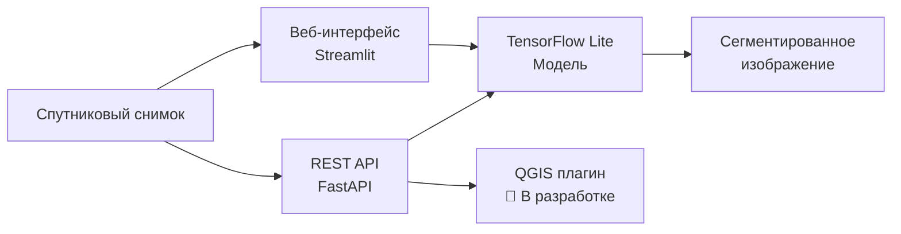

# 🛰️ Semantic Satellite Segmentation

<div align="center">


<h3>🚀 Веб-приложение для автоматической семантической сегментации спутниковых снимков</h3>

[**🔗 ПОПРОБОВАТЬ ПРИЛОЖЕНИЕ**](https://dpo-segmentation-model.streamlit.app/) • [Установка](#-быстрый-старт) • [API](#-api-документация) 

</div>

---

## 🎥 Демонстрация

<div align="center">
  
</div>

## 🌐 Онлайн-версия

<div align="center">

### 👉 [**ОТКРЫТЬ ПРИЛОЖЕНИЕ**](https://dpo-segmentation-model.streamlit.app/) 👈

| 🔗 Компонент | URL | ⚡ Статус |
|--------------|-----|----------|
| **Frontend** | [dpo-segmentation-model.streamlit.app](https://dpo-segmentation-model.streamlit.app/) |  |
| **Backend API** | [dpo-segmentation-model.onrender.com](https://dpo-segmentation-model.onrender.com) |  |

</div>

> ⚠️ **Важно:** Первый запуск может занять до 2-3 минут из-за холодного старта сервера. Используйте изображения с разрешением не более **512x512 px** из-за ограничений бесплатного хостинга. Для работы с большими изображениями рекомендуется локальное развертывание.

## 🚀 Возможности

<table>
<tr>
<td width="50%">

### 🚀 Основные функции

- **6 классов сегментации** с высокой точностью
- **Веб-интерфейс** для быстрой обработки
- **REST API** для интеграции
- **Пакетная обработка** изображений
- **QGIS плагин** (в разработке)

</td>
<td width="50%">

### 🎨 Классы объектов

| Класс | Цвет | Hex |
|-------|------|-----|
| 🏠 Здания |  | `#3C1098` |
| 🌍 Земля |  | `#8429F6` |
| 🛣️ Дороги |  | `#6EC1E4` |
| 🌳 Растительность |  | `#FEDD3A` |
| 💧 Вода |  | `#E2A929` |
| ⬜ Неразмеченное |  | `#9B9B9B` |

</td>
</tr>
</table>

## 🏗️ Архитектура



## 💻 Технологический стек

<div align="center">

| Backend | Frontend | ML/DL | Обработка изображений |
|---------|----------|-------|----------------------|
|  |  |  |  |
|  |  |  |  |

</div>

## 🚀 Быстрый старт

### 📋 Требования

- **Python** 3.8-3.10
- **RAM** 4GB+
- **Disk** 500MB свободного места

### 📦 Установка

```bash
# Клонирование репозитория
git clone https://github.com/yourusername/satellite-segmentation.git
cd satellite-segmentation

# Создание виртуального окружения
python -m venv venv
source venv/bin/activate  # Linux/Mac
# или
venv\Scripts\activate  # Windows

# Установка зависимостей
pip install -r requirements.txt
```

### ⚡ Запуск приложения

<details>
<summary><b>🖥️ Backend сервер</b></summary>

```bash
uvicorn main:app --reload --host 0.0.0.0 --port 8000
```

Сервер будет доступен по адресу: http://localhost:8000

</details>

<details>
<summary><b>🎨 Frontend интерфейс</b></summary>

```bash
streamlit run app.py
```

Интерфейс будет доступен по адресу: http://localhost:8501

</details>

## 📖 API Документация

### 🔧 Endpoints

#### `POST /predict/`

Выполняет семантическую сегментацию загруженного изображения.

<details>
<summary><b>Параметры запроса</b></summary>

| Параметр | Тип | По умолчанию | Описание |
|----------|-----|--------------|----------|
| `file` | `File` | обязательный | Изображение для сегментации |
| `patch_size` | `int` | 256 | Размер патча (128-512) |
| `subdivisions` | `int` | 2 | Количество подразделений (1-4) |

</details>

<details>
<summary><b>Пример использования</b></summary>

**Python (requests):**
```python
import requests

url = "http://localhost:8000/predict/"
files = {"file": open("satellite.jpg", "rb")}
params = {"patch_size": 256, "subdivisions": 2}

response = requests.post(url, files=files, params=params)

with open("result.png", "wb") as f:
    f.write(response.content)
```

**cURL:**
```bash
curl -X POST "http://localhost:8000/predict/?patch_size=256&subdivisions=2" \
     -H "accept: image/png" \
     -F "file=@satellite.jpg" \
     -o result.png
```

</details>

## 🔬 О проекте

### 🧠 Модель

<table>
<tr>
<td width="60%">

**Архитектура:**
- 🏗️ **Backbone:** EfficientNet-B1
- 🔄 **Архитектура:** U-Net
- 📊 **Формат:** TensorFlow Lite (квантованная)
- 📏 **Размер модели:** ~20MB
- ⚡ **Скорость:** 2-5 сек на изображение 1024x1024

</td>
<td width="40%">

**Алгоритмы обработки:**
1. 🚀 **Быстрый** - оптимизированная обработка
2. 🎨 **Качественный** - плавные переходы между патчами

</td>
</tr>
</table>

### 📂 Структура проекта

```
📦 satellite-segmentation/
├── 📄 main.py                 # FastAPI backend
├── 🎨 app.py                  # Streamlit frontend  
├── ⚙️ config.py               # Конфигурация
├── 📋 requirements.txt        # Зависимости
├── 🤖 model_f16.tflite       # Модель (скачать отдельно)
└── 📁 utils/                  # Вспомогательные модули
    ├── 🔧 model_loader.py     # Загрузчик модели
    ├── 🎯 prediction.py       # Алгоритмы предсказания
    ├── 🖼️ image_processing.py # Обработка изображений
    └── 🪟 window.py           # Оконные функции
```

## 🔮 Планы развития

- [ ] 🗺️ **QGIS плагин** - интеграция с ГИС
- [ ] 🌐 **Веб-сервис** - облачная версия
- [ ] 📱 **Мобильное приложение**
- [ ] 🚀 **GPU ускорение**
- [ ] 📊 **Дополнительные классы** объектов
- [ ] 🌍 **Поддержка GeoTIFF**


